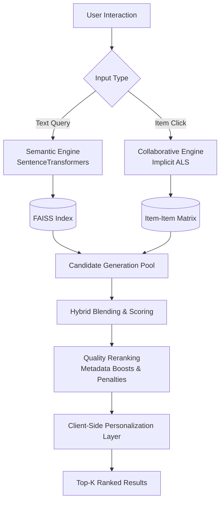

# PodcastMind: Hybrid Recommendation Engine

**Live Demo:** [podcast-mind.streamlit.app](https://podcast-mind-tghvnrjtrwba5tft8gmprt.streamlit.app/)

PodcastMind is a production-grade recommendation system built to solve the podcast discovery problem. Instead of relying on basic keyword matching, this system uses a hybrid architecture combining **dense vector semantic search** and **collaborative filtering** to deliver highly relevant, explainable recommendations.

I built this project to demonstrate end-to-end machine learning engineering—from raw data processing to deploying a unified retrieval and ranking pipeline.

---

## 🏗️ System Architecture

The core of PodcastMind is its multi-stage ranking pipeline. When a user interacts with the app (via search or clicking a podcast), the system executes a sequence of retrieval, blending, and reranking steps.



---

## ⚙️ Core Engineering Components

### 1. Semantic Retrieval (FAISS + MiniLM)
Keyword search struggles with podcasts because descriptions are often abstract. I used `sentence-transformers/all-MiniLM-L6-v2` to generate 384-dimensional dense embeddings for podcast metadata. 
*   **Vector Storage:** The embeddings are indexed using `FAISS` (Facebook AI Similarity Search).
*   **Performance:** FAISS enables approximate nearest neighbor (ANN) retrieval across thousands of records in sub-millisecond timeframes.

### 2. Collaborative Filtering (ALS)
To capture behavioral patterns (i.e., "users who liked this also liked that"), I implemented an Alternating Least Squares (ALS) matrix factorization model using the `implicit` Python library. 
*   This engine handles the "Explore Similar" feature, weighting behavioral signals heavier than semantic similarity when a user is deep-diving into a specific show.

### 3. The Hybrid Engine (Ranking & Reranking)
Retrieving candidates is only the first step. The `HybridEngine` orchestrates the final output:
*   **Min-Max Normalization:** Aligns the wildly different score scales from FAISS (L2 distances) and ALS (dot products) to a standardized 0.0-1.0 range.
*   **Weighted Blending:** Dynamically adjusts the importance of semantic vs. collaborative signals based on the user's context (e.g., Search = 100% Semantic, Discovery = 70% Collab / 30% Semantic).
*   **Drift Penalization:** Aggressively penalizes results that drift too far from the original semantic intent.

### 4. Zero-Login Personalization
I wanted to reduce user friction while still offering a tailored feed.
*   The system uses local browser state to track user category preferences.
*   These preferences are passed into the hybrid engine to apply soft +25% boosts to relevant candidates during the final reranking phase.

---

## 🛠️ Technology Stack

*   **App Framework:** Streamlit (Unified frontend/backend for rapid cloud deployment)
*   **Machine Learning:** `sentence-transformers`, `faiss-cpu`, `implicit`, `scikit-learn`
*   **Data Processing:** `pandas`, `numpy`
*   **Language:** Python 3.10+

*Note: A previous iteration utilized FastAPI and React, but the architecture was migrated to Streamlit to simplify hosting the ML models on cloud infrastructure without hitting strict serverless memory limits.*

---

## 🚀 How to Run Locally

If you want to spin up the recommendation engine on your own machine:

### Prerequisites
*   Python 3.10 or higher
*   Git

### Setup

1.  **Clone the repository:**
    ```bash
    git clone https://github.com/your-username/podcast-mind.git
    cd podcast-mind
    ```

2.  **Create a virtual environment:**
    ```bash
    python -m venv venv
    
    # Windows
    venv\Scripts\activate
    
    # macOS/Linux
    source venv/bin/activate
    ```

3.  **Install dependencies:**
    ```bash
    pip install -r requirements.txt
    ```

4.  **Run the Streamlit App:**
    ```bash
    streamlit run streamlit_app.py
    ```

The app will initialize the models, load the FAISS index from the `/artifacts` directory into memory, and launch the UI on `http://localhost:8501`.

---

## 📊 Design Trade-offs & Decisions

*   **No LLMs for Generation:** I intentionally avoided using LLMs (like GPT-4) for generating the recommendations. While LLMs are great for natural language, they introduce unacceptable latency and non-determinism into a ranking pipeline. This system prioritizes speed, explainability, and mathematical rigor.
*   **Pre-computed Artifacts:** The FAISS index and ALS models are pre-trained and saved as pickle/index files in the `artifacts/` folder. The app loads these into memory on startup rather than computing them on the fly, mimicking how production inference servers operate.
