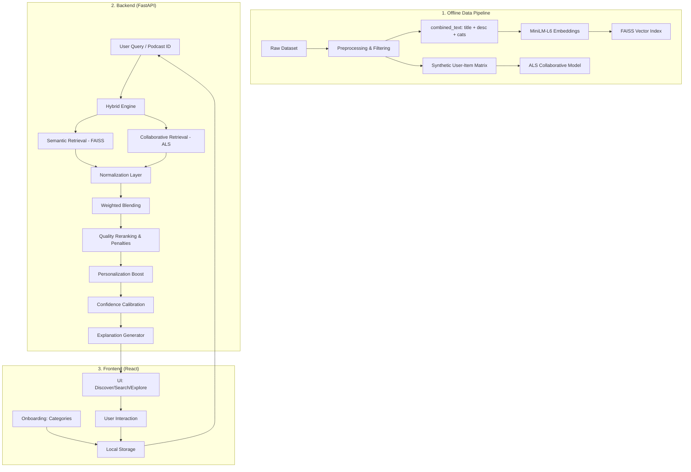

# PodcastMind Architecture

PodcastMind is a **retrieval-first and ranking-first** recommendation system. It avoids the non-deterministic nature of LLMs to provide fast, explainable, and psychologically grounded podcast discovery.

## System Flow Diagram

## Core Engine Logic

### 1. The Retrieval Phase
*   **Semantic:** Uses `FAISS` to find the nearest neighbors in a 384-dimensional vector space. It understands that "Artificial Intelligence" is related to "Machine Learning" even without keyword overlap.
*   **Collaborative:** Uses `Implicit (ALS)` to identify shows that "users like you" also enjoyed. This introduces serendipity (discovery) beyond direct semantic relevance.

### 2. The Ranking Phase (The "Brain")
*   **Min-Max Normalization:** Disparate scores from FAISS and ALS are brought onto a [0, 1] scale for fair blending.
*   **Quality Reranking:** Podcasts with "spammy" titles (URLs), filler descriptions ("Welcome to my show"), or poor metadata are automatically penalized.
*   **Personalization Boost:** User preferences from onboarding provide a +25% soft-boost to matching categories.

### 3. The Trust Layer
*   **Confidence Calibration:** Raw ML scores are compressed into a realistic 78%-94% range to avoid "perfect 1.0" scores that users find suspicious.
*   **Natural Language Explanations:** Every result explains *why* it was chosen (e.g., "Matches your interest in History").
